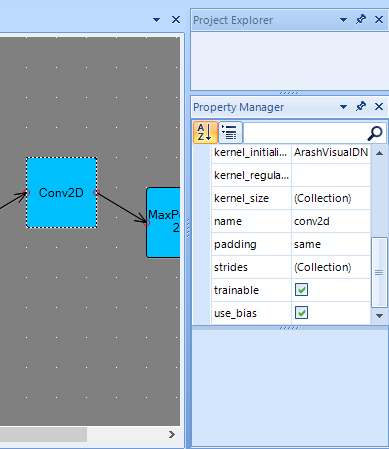

# ArashVisualDNN
This is a deep learning visualization tool which can Deserialize Keras Json model to a graph and and serialize the edited model to Json model file format.

Editing layer's property using PropertyBar

Sample Output

